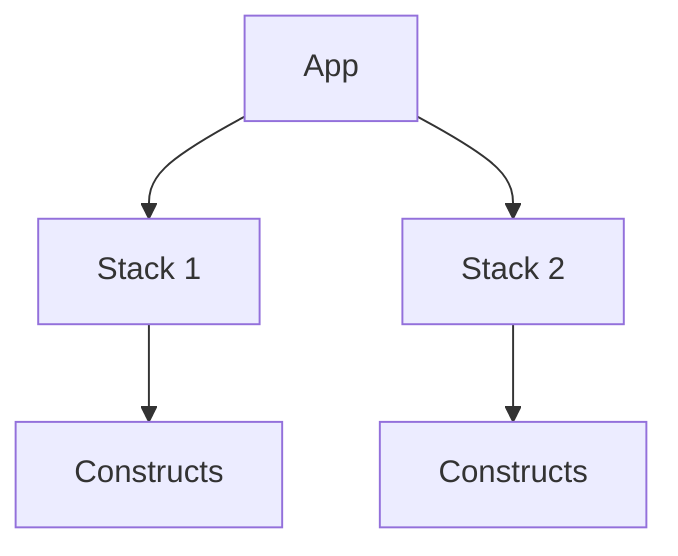
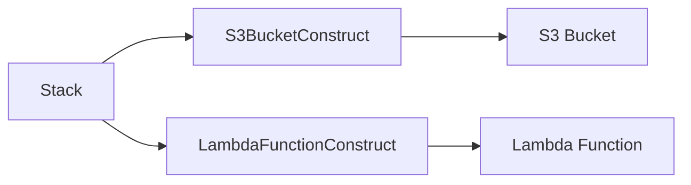
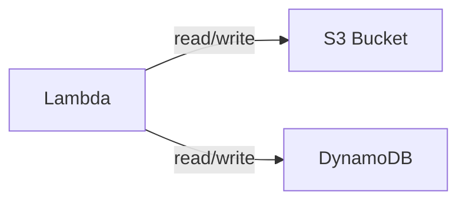
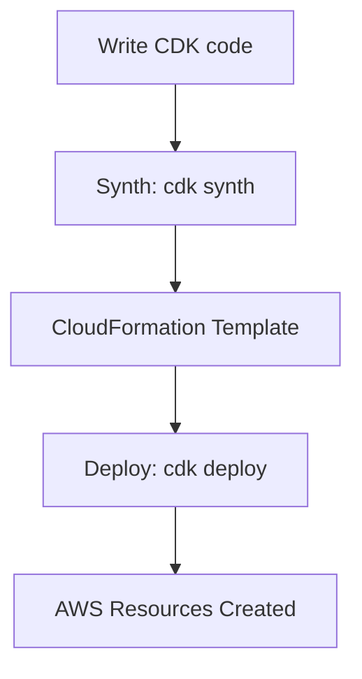

***

# AWS CDK for TypeScript Devs  
*Quick, Practical Notes with Graphs & Diagrams*

***

## 1. CDK Architecture Overview

**What is CDK?**  
- Define cloud infrastructure using TypeScript (or other languages)  
- Generates CloudFormation templates  
- Full code, version control, modularity, strong typing

**Diagram: CDK App Structure**



- **App**: root container for stacks
- **Stack**: unit of deployment (maps to a CloudFormation stack)
- **Construct**: reusable cloud components

***

## 2. Setting Up Your Project

**Install prerequisites:**
- Node.js (LTS)
- AWS CLI + Credentials
- CDK Toolkit

```bash
npm install -g aws-cdk
cdk --version
```

**Bootstrap AWS Environment**  
(required once per AWS account/region):
```bash
cdk bootstrap
```

**Project Setup**
```bash
cdk init app --language=typescript
npm install @aws-cdk/aws-s3 @aws-cdk/aws-lambda @aws-cdk/aws-dynamodb
```

> **Directory structure:**
> ```
> ├── bin/
> ├── lib/
> ├── node_modules/
> └── cdk.json
> ```

***

## 3. Building Blocks: Stacks & Constructs

**Stacks**
```typescript
import { Stack, StackProps } from 'aws-cdk-lib';
import { Construct } from 'constructs';

export class MyStack extends Stack {
  constructor(scope: Construct, id: string, props?: StackProps) {
    super(scope, id, props);
    // define resources here
  }
}
```
- One stack = one deployed unit

**Constructs**  
Reusable building blocks, can be AWS resources or custom logic.



***

## 4. Common AWS Resources Patterns

### a. **S3 Bucket**

```typescript
import { Bucket } from 'aws-cdk-lib/aws-s3';
const uploadsBucket = new Bucket(this, 'UploadsBucket', {
  versioned: true,
  publicReadAccess: false,
});
```

### b. **Lambda Function**

```typescript
import { Function, Runtime, Code } from 'aws-cdk-lib/aws-lambda';
const lambdaFunc = new Function(this, 'FileHandler', {
  runtime: Runtime.NODEJS_18_X,
  handler: 'index.handler',
  code: Code.fromAsset('lambda'),
});
```

### c. **DynamoDB Table**

```typescript
import { Table, AttributeType } from 'aws-cdk-lib/aws-dynamodb';
const filesTable = new Table(this, 'FilesTable', {
  partitionKey: { name: 'fileId', type: AttributeType.STRING }
});
```

***

## 5. Permissions & Integration

**Grant Lambda access to S3:**
```typescript
uploadsBucket.grantReadWrite(lambdaFunc);
```
**Lambda to DynamoDB:**
```typescript
filesTable.grantReadWriteData(lambdaFunc);
```

**IAM Policy Example:**
```typescript
lambdaFunc.addToRolePolicy(new PolicyStatement({
  actions: ['s3:GetObject'],
  resources: [uploadsBucket.bucketArn + "/*"],
}));
```

**Diagram: Permissions Mapping**


***

## 6. Lifecycle & Best Practices

**Lifecycle: Deploy, Update, Delete**

```bash
cdk diff    # Show changes
cdk deploy  # Apply changes
cdk destroy # Remove stack & resources
```

**Best Practices:**
- Parameterize stack for reuse
- Use environment variables for separation
- Group constructs logically (`lib/constructs/`)
- Use single-responsibility principle for constructs
- Always use version control

**Diagram: CDK Workflow**



***
